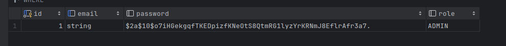

# VK Java Test Task
Инструменты: java 21, Spring, Maven, Postgres, JPA
## Требования:

### 1. Реализовать обработчики, которые проксируют запросы к [jsonplaceholder](rhttps://jsonplaceholder.typicode.com/)
Реализованы обработчики `GET, POST, PUT, PATCH, DELETE`:
* `/api//users/` проксирует запрос к [https://jsonplaceholder.typicode.com/users](https://jsonplaceholder.typicode.com/users)
* `/api/posts/` проксирует запрос к [https://jsonplaceholder.typicode.com/users](https://jsonplaceholder.typicode.com/posts)
* `/api/albums/` проксирует запрос к [https://jsonplaceholder.typicode.com/users](https://jsonplaceholder.typicode.com/albums)

В приложении реализовано OpenApi 3.0, все достуные запросы можно посмотреть там
### 2. Реализовать базовую авторизацию.

Реализована авторизация с JWT токенами и роли реализованы с помощью модуля Spring Security.

### 3. Проработать ролевую модель доступа.

Реализована расширенная ролевая модель с привилегиями

```java
 ADMIN(
            Set.of(
                    POST_VIEWER,
                    POST_EDITOR,
                    USER_VIEWER,
                    USER_EDITOR,
                    ALBUM_VIEWER,
                    ALBUM_EDITOR,
                    COMMENT_VIEWER,
                    PHOTO_VIEWER,
                    TODO_VIEWER
            )
    ),
    POSTS(
            Set.of(
                    POST_VIEWER,
                    POST_EDITOR,
                    COMMENT_VIEWER
            )),
    USERS(
            Set.of(
                    POST_VIEWER,
                    USER_VIEWER,
                    USER_EDITOR,
                    ALBUM_VIEWER,
                    TODO_VIEWER
            )
    ),
    ALBUMS(Set.of(
            ALBUM_EDITOR,
            PHOTO_VIEWER
    ));
```

### 4. Реализовать ведение аудита действий.

Аудит реализовон с помощью имплементации интерфейса **AuthorizationEventPublisher**. Таким образом, публикуются все события авторизации, за исключением промежуточных.

Пример работы аудита


Текущие пользователи 

### 5. Реализовать inmemory кэш.

Кэш реализован с помощью Spring Cache. 
- Для запросов типа `GET` использована аннотация ` @Cacheable` 
- Для запросов типа `POST, PUT, PATCH` использована аннотация ` @CachePut` 
- Для запросов типа `DELETE` использована аннотация ` @CacheEvict` 

Конфигурация кэшей находится в application.properties
```spring.cache.caffeine.spec=maximumSize=500,expireAfterAccess=600s```
## Дополнительно:

### 0. Простота запуска приложения.
Конфигурация приложения находится в  `application.properties`

Для быстрого запуска и настройки базы данных использован `docker-compose`

**Запуск приложения**:
```
docker-compose up
mvn clean install
java -jar target/vkk-0.0.1-SNAPSHOT.jar
```

### 1. Использование базы данных.

В проекте использовалась реляционная база данных **Postgres**:
* Для ведения аудита
* Для хранения данных пользователей


### 2. Добавление REST Api для создания пользователей.

Добавлен обработчик **registry**, который позволяет зарегестрироваться новому пользователю по имени и паролю.

### 3. Расширенная ролевая модель.
Используется ролевая модель с привилегиями для более детального управления доступом.

### 4. Написание тестов
Реализованы тесты для всех запросов

### 5. Реализация конечной точки для запросов по WebSocket:

Создана конечная точка по адресу /ws, которая перенаправляет запросы к [echo-server](https://websocket.org/tools/websocket-echo-server/).

Для подключения к этой точке требуется наличие роли ADMIN. Все подключения к этой точке отслеживаются аудитом.


