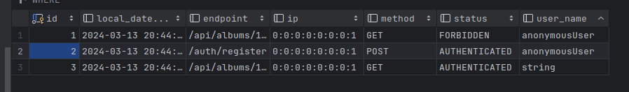

# Pet Project: JSONPlaceholder API Proxy with Enhanced Security
Tech Stack: Java 21, Spring Boot, Maven, PostgreSQL, JPA, Spring Security, OpenAPI 3.0
## Key Features & Implementation:

### 1. REST API Proxy to [JSONPlaceholder](rhttps://jsonplaceholder.typicode.com/)
Implemented `GET, POST, PUT, PATCH, DELETE` handlers for:
* `/api//users/` -> [https://jsonplaceholder.typicode.com/users](https://jsonplaceholder.typicode.com/users)
* `/api/posts/` -> [https://jsonplaceholder.typicode.com/users](https://jsonplaceholder.typicode.com/posts)
* `/api/albums/` -> [https://jsonplaceholder.typicode.com/users](https://jsonplaceholder.typicode.com/albums)

Documented all endpoints with OpenAPI 3.0 (Swagger).
### 2. JWT Authentication & Role-Based Access Control.

- Secured endpoints using Spring Security with JWT tokens.
- Implemented granular privileges (e.g., `POST_VIEWER`, `USER_EDITOR`) and predefined roles:

```java
 ADMIN(
            Set.of(
                    POST_VIEWER,
                    POST_EDITOR,
                    USER_VIEWER,
                    USER_EDITOR,
                    ALBUM_VIEWER,
                    ALBUM_EDITOR,
                    COMMENT_VIEWER,
                    PHOTO_VIEWER,
                    TODO_VIEWER
            )
    ),
    POSTS(
            Set.of(
                    POST_VIEWER,
                    POST_EDITOR,
                    COMMENT_VIEWER
            )),
    USERS(
            Set.of(
                    POST_VIEWER,
                    USER_VIEWER,
                    USER_EDITOR,
                    ALBUM_VIEWER,
                    TODO_VIEWER
            )
    ),
    ALBUMS(Set.of(
            ALBUM_EDITOR,
            PHOTO_VIEWER
    ));
```

### 3. Action Auditing.

Tracked authentication events via custom **AuthorizationEventPublisher**.
All auth actions are logged except for intermediate steps.

Auditor work example


Current users

### 4. In-Memory Caching.

Configured Spring Cache with  Spring Cache. 
- `@Cacheable` for `GET` requests
- `@CachePut` for `POST/PUT/PATCH`
- `@CacheEvict` for `DELETE`

Cache policy
```spring.cache.caffeine.spec=maximumSize=500,expireAfterAccess=600s```
## Additional Features:

### 0. Simple app run.
Configuration is in  `application.properties`

For fast run and database used `docker-compose`

**App run**:
```
docker-compose up
mvn clean install
java -jar target/vkk-0.0.1-SNAPSHOT.jar
```

### 1. About database.

Used PostgreSQL for:
* Audit logging
* User management

### 2. Creating REST Api for user creation.

Added `/registry` endpoint for new user signups

### 3. Extended role-based access control.
Privilege-based role model for granular access management.

### 4. Testing
Comprehensive unit/integration tests for all endpoints

### 5. WebSocket Proxy:

Secured `/ws` endpoint (forwarding to [websocket.org](https://websocket.org/tools/websocket-echo-server/) echo server) with ADMIN-only access.

To connect to this endpoint, you need the ADMIN role. All connections to this endpoint are tracked by audit.


